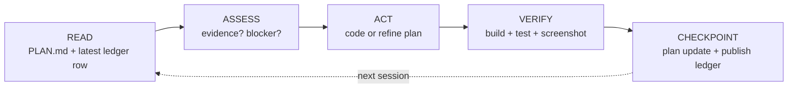
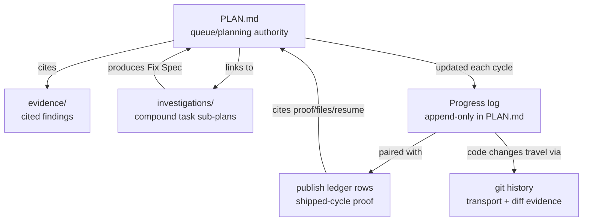

# Architecture

Vidux has three layers: **doctrine** (the rules), **the cycle** (the loop), and **the store** (the files).

```
┌─────────────────────────────────────────────────┐
│                    DOCTRINE                      │
│  13 principles + gate patterns + stuck detect    │
└──────────────────────┬────────────────────────────┘
                        │ governs
┌───────────────────────▼──────────────────────────┐
│                    THE CYCLE                      │
│  Read → Assess → Act → Verify → Checkpoint        │
└──────────────────────┬────────────────────────────┘
                        │ reads/writes
┌───────────────────────▼──────────────────────────┐
│                    THE STORE                      │
│  PLAN.md + publish ledger + evidence + git        │
└────────────────────────────────────────────────────┘
```

The store also has an optional read/write surface: **Vidux Browse**, a local
HTTP server (`bin/vidux-browse` → `browser/server.py`) that renders PLAN.md
files, the fleet queue, and HTML artifacts in a browser, and accepts comments
without editing source files directly. It's a view onto the same store above,
not a fourth layer — see "Browser GUI" below.

## File Layout

```
vidux/
├── SKILL.md              # Sole skill/plugin entrypoint: principles, cycle, PLAN.md template
├── DOCTRINE.md           # Extended doctrine (13 principles + gate patterns)
├── docs/                 # VitePress site: guide, concepts, fleet, reference (loop, enforcement, ingredients, writing-style)
├── bin/
│   ├── vidux             # CLI entrypoint — dispatches every subcommand below
│   └── vidux-browse      # Launches the Browser GUI (browser/server.py)
├── browser/               # Browser GUI: local read/write surface onto the store
│   ├── server.py          # HTTP server: plan rendering, comments, artifacts API
│   ├── static/            # Front-end (index.html, app.js, style.css)
│   ├── artifacts/         # Generated HTML artifact pages
│   └── tests/             # Playwright e2e + unit tests for the GUI
├── references/            # Deep docs loaded on demand (automation.md)
├── scripts/                        # ~30 focused CLI helpers, each one job; grouped by concern:
│   ├── lib/                        # Shared shell functions (compat.sh, etc.)
│   ├── vidux-loop.sh                # Cron driver — fires the cycle
│   ├── vidux-checkpoint.sh          # Writes Progress/Tasks/Drift Log + publish ledger row
│   ├── vidux-status.py              # Task/plan status computation (pending/in_progress/blocked/…)
│   ├── vidux-plan-guard.sh          # Enforces plan-discipline invariants (authorized deletions, etc.)
│   ├── vidux-doctor.sh / -doctor-cli.sh  # Diagnose plan/store/checkout health
│   ├── vidux-config.py              # Reads/validates vidux.config.json
│   ├── vidux-http-smoke.py          # Observe-only HTTP reachability probe
│   ├── vidux-worktree-gc.py         # Cleans up stale/detached git worktrees
│   └── vidux-public-ready-grep-gate.py  # Scans for private-path/identifier leaks before release
├── hooks/                 # Git hooks for plan discipline
│   ├── hooks-reference.json  # Cross-tool example manifest (not an auto-loaded Claude Code plugin hooks file)
│   ├── pre-commit-plan-check.sh
│   ├── post-commit-checkpoint.sh
│   └── three-strike-gate.sh
├── guides/                # Deep dives (not needed for basic use)
│   ├── draft-pr-flow.md   # How automation lanes push code
│   ├── fleet-ops.md       # Automation fleet management
│   ├── harness.md         # Writing automation prompts
│   ├── investigation.md   # Compound task L2 format
│   └── evidence-format.md
├── tests/                 # Contract tests (pytest) for scripts/, bin/, and cross-file invariants
│   └── test_vidux_contracts.py
└── examples/              # Worked examples
    └── bug-fix-lifecycle/
```

## The Cycle

Every agent session — human-triggered or cron — runs the same five steps:



**Read:** Load PLAN.md, check the latest matching publish or handoff ledger row, check for in-progress tasks (crash recovery), and scan git log/diff.

**Assess:** Does the next task have evidence? If yes, execute. If no, gather it locally — no commit or PR until the fix ships.

**Act:** Execute one task or refine the plan. Agents keep working through the queue until they hit a real boundary — context limit, external blocker, or empty queue.

**Verify:** Build must pass. Tests must pass. UI work requires visual proof (screenshot, simulator). "It works" is never sufficient.

**Checkpoint:** Update Progress/Tasks/Drift Log in PLAN.md, emit a publish ledger row with proof, handoff status, files claimed, and next-agent resume, then use git commit/push only as transport when code changed.

## The Store

Planning state lives in markdown files in git, and shipped-cycle proof lives in append-only publish ledger rows. No product database or chat history is the coordination store.



A project has exactly **one PLAN.md** as its queue/planning authority. Course corrections update the Decision Log or Drift Log -- they never spawn a sibling plan. Evidence files back every plan entry. Matching publish ledger rows prove shipped cycles with task id, proof, handoff status, files claimed, and resume metadata. Investigation files handle compound tasks that need root cause analysis before code.

## Browser GUI

`bin/vidux-browse` starts a local HTTP server (`browser/server.py`, stdlib
`http.server` — no framework) that renders the store above as a browsable
interface instead of raw files:

```
bin/vidux-browse → browser/server.py ──reads/writes──> the store (PLAN.md, evidence/, artifacts/)
                          │
                          └──serves──> browser/static/ (index.html + app.js + style.css)
```

- **Read**: lists discovered plans (scanning under a configurable root),
  renders a plan's Tasks/Progress/Drift Log, and serves generated HTML
  artifacts under `browser/artifacts/`.
- **Write**: accepts inline comments anchored to a plan or artifact (stored in
  the separate append-only comments JSONL, never the source files), bounded
  local notes into a plan's `INBOX.md`, and one-shot steering intents queued in
  the local steering mailbox for the host to lease at a safe cycle boundary.
- **Safety model**: binds to loopback by default; write routes require the
  request to originate from loopback (or an explicitly allowlisted LAN host
  in `VIDUX_BROWSER_HOST=0.0.0.0` mode) via Host-header + Origin checks — see
  `docs/reference/browser.md` for the full read/write safety model.

The GUI is optional. Every capability it exposes (reading a plan, adding a
comment) has an equivalent file-based path (`cat PLAN.md`, edit the Drift Log
directly) — the browser is a convenience layer, not a second source of truth.

## Fleet Architecture

For automation at scale, vidux supports multiple agents working the same plan:

```
Writer Agent     ──┐
Radar Agent      ──┼── all read/write ──> PLAN.md (git branch)
Coordinator      ──┘
```

- **Writers** ship code. One writer per project surface.
- **Radars** monitor surfaces (read-only). They find work; they never fix it.
- **Coordinators** audit the fleet — flag stuck agents, handoff gaps, bimodal quality.

Each agent runs as a stateless cron. They share queue state through PLAN.md, shipped-cycle proof through publish ledger rows, and transport/diff evidence through git, never through chat memory or message passing.

## Extensions

Vidux core is markdown + git, and that is the whole store. There is no
external-board or issue-tracker integration — `PLAN.md` in git is the only
queue/planning authority. See `docs/concepts/extensions.md`.

## Hook Enforcement

Optional git hooks enforce plan discipline:

| Hook | What it checks |
|------|---------------|
| `pre-commit-plan-check.sh` | Code changes have a corresponding PLAN.md update |
| `post-commit-checkpoint.sh` | Checkpoint format is correct |
| `three-strike-gate.sh` | Same task stuck 3+ cycles = blocked |

Install by copying the hook scripts directly into the target repo:

```bash
cp hooks/pre-commit-plan-check.sh /path/to/project/.git/hooks/pre-commit
cp hooks/post-commit-checkpoint.sh /path/to/project/.git/hooks/post-commit
cp hooks/three-strike-gate.sh /path/to/project/.git/hooks/
chmod +x /path/to/project/.git/hooks/{pre-commit,post-commit,three-strike-gate.sh}
```

## Design Decisions

**Why markdown?** Any agent that reads files can participate. No SDK, no API, no vendor lock-in.

**Why one plan?** Multiple plan files create coordination overhead. One queue/planning authority, with publish ledger rows for shipped proof, keeps pivots resumable. Decision Log handles direction changes.

**Why stateless cycles?** Sessions die. Context windows fill. Auth expires. The reliable recovery packet is the owning PLAN.md update plus the matching publish ledger row; git records the transport and diff when code changed. Design for interruption, not for persistence.

**Why evidence-first?** A plan entry without evidence is a guess. Guesses cause rework. Evidence costs 2-5 minutes. Rework costs 15-60 minutes.
