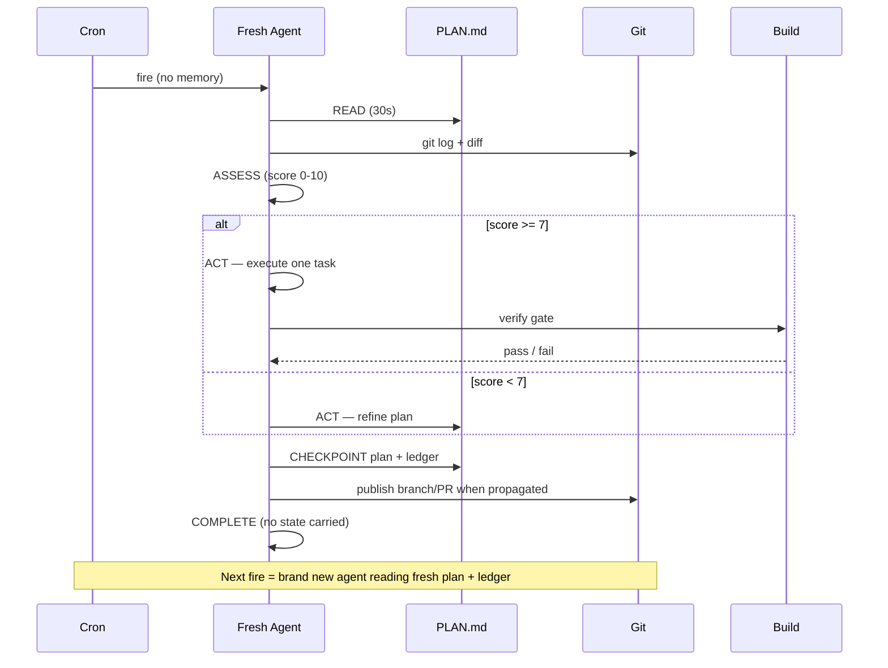

# Vidux Loop Mechanics

> The 30% — how the cron actually works.

## The Stateless Cycle

Every cron fire is a fresh context: no memory, no carried state. Only repo files plus the append-only ledger. The next agent knows only what's in the files.

```
[Cron fires] -> READ -> ASSESS -> ACT -> VERIFY -> CHECKPOINT
```



## Step 1: Read (30 seconds)

Read in order. Stop if any is missing — that's your first task.

1. `PLAN.md` — the queue/decisions/constraints/Progress authority. Take the first `[in_progress]` task (resume priority — a prior session may have died mid-task); else the first `[pending]` (or unchecked `[ ]` in v1).
2. **Decision Log** — read `## Decision Log` before acting. If `vidux-loop.sh` emits `decision_log_warning: true`, review every entry. You MUST NOT contradict a logged direction; skip any action that would.
3. Drift feedback cache, if configured: apply any prevention hint matching the current task before editing.
4. `git log --oneline -10` — commits since last checkpoint?
5. `git diff --stat` — uncommitted work from a crashed session?
6. Worktree classifier — before minting a branch or abandoning one: `python3 ~/Development/vidux/scripts/vidux-worktree-gc.py --base origin/main <repo>`. Resume or record lane-owned `dirty`, `closed_unmerged`, or `unmerged_no_pr` rows first. `open_pr` rows are durable handoff — nurse or record them. Only `merged_clean` rows auto-clean.
7. Ledger, if available: `tail -5 ~/.agent-ledger/activity.jsonl | jq '.summary'`

On crash WIP: preserve first. Inspect `git status` + `git diff --stat`, decide whether the work belongs to the current `PLAN.md` row, and record the recovery path in the owning plan plus a ledger handoff before any commit, push, cleanup, or overwrite. NEVER commit unknown WIP to clean the tree.

## Step 2: Assess (30 seconds)

### Q1: Is the plan ready for code?

Score the checklist. 1 point each, minimum 7/10 to start coding.

**Required (0 points total if any fails):**
- [ ] Purpose filled (not empty/placeholder)
- [ ] Evidence has >= 3 cited sources with `[Source:]` markers
- [ ] Constraints has >= 1 ALWAYS and >= 1 NEVER
- [ ] >= 1 Task exists with evidence cited
- [ ] No unanswered question cited as blocker in the NEXT task

**Quality (+1 each):**
- [ ] >= 1 EXTERNAL evidence source (MCP/web, not just codebase)
- [ ] >= 1 stakeholder preference in Constraints (reviewer, tech lead, PM)
- [ ] Tasks carry `[Depends:]` markers where applicable
- [ ] Decisions section has >= 1 entry with alternatives + rationale
- [ ] No vague task ("implement feature" without specifics)

**Scoring:** 10 = execute with confidence; 7-9 = execute, expect surprises; 5-6 = gather evidence before coding; 0-4 = sketch only (do NOT code; refine the plan).

Below 7, the cycle's one deliverable is the plan, not code. This enforces the 50% plan-refinement budget.

### Q2: Highest-impact next action?

Priority order:
1. `[in_progress]` — resume; a prior session died mid-task.
2. Task-linked blocker — if the NEXT pending task cites an unanswered question, research it first (per-task gating; a free-floating question list does NOT block execution).
3. `[pending]` without evidence — gather it.
4. First `[pending]` with evidence — set `[in_progress]`, execute.
5. All `[completed]` — verify final state, update Progress, mark mission complete.

### Q3: Parallelize?

If the task benefits from research fan-out, dispatch agents; else one task at a time.

## Step 3: Act (bulk of the cycle)

### Resuming `[in_progress]`:

1. Read the task description + partial work in git diff.
2. Verify partial work (build/test gate): complete -> `[completed]` + checkpoint; incomplete -> continue from where it stopped.
3. NEVER restart from scratch — check what's done first.

### Refining the plan:

**Evidence fan-out** — spawn up to 4 parallel research agents:
- A: team chat for conventions/decisions
- B: code reviews for related PRs/feedback
- C: codebase for existing patterns (grep, glob)
- D: issue tracker for requirements/constraints

Each returns `{ source, finding, confidence: high|medium|low }`. You synthesize into the Evidence section.

**Task-linked blockers** — take the first unanswered question on the next pending task, research it (web/MCP/codebase), write the answer in Evidence, clear the annotation (or convert to constraint/decision).

**Adding tasks** — decompose into checkbox tasks, each citing evidence, with `[Depends: Task N]` markers.

### Executing code — compound task (`[Investigation: ...]`):

1. Read the investigation file. Fix Spec empty -> this cycle completes the investigation (evidence, root cause, impact map, fix spec), then checkpoint. Fix Spec ready -> execute.
2. Execute the fix spec. One surface, all tickets.
3. Verify — run the investigation file's gate.
4. Update both files: investigation Gate items checked, parent task `[completed]`.

### Executing code — atomic task:

1. Locate the task in PLAN.md; read description + evidence.
2. Scope the files. NEVER touch files outside the task.
3. Execute one code change. Not two.
4. Verify — run the task's build/test gate. Pass -> checkpoint. Fail -> retry once with a targeted fix. Still failing -> stuck-detection protocol (SKILL.md § Stuck detection (adaptive)).
5. Set `[completed]`: `- [completed] Task N: ... [Done: date]`

### All tasks done:

1. Run full build + test suite.
2. Update Progress: "All tasks complete. Final verification: [PASS/FAIL]".
3. Update the PR description if a PR exists.
4. Mark mission complete in ledger (if wired).

## Step 4: Checkpoint (30 seconds)

A cycle commits only when code changed. Investigation-only cycles keep notes on disk — no commit, no PR; the next cycle reads `investigations/<slug>.md` and continues. PLAN.md-only changes (row flips, Progress) bundle into the next code commit — never ship standalone.

**Commit message (when code changed):**
```
vidux: [what you did]

Plan: [which task]
Evidence: [new evidence, if any]
Next: [next cycle's job]
Blocker: [if any, or "none"]
```

**Progress entry:**
```
- [DATE TIME] Cycle N: [what happened]. Next: [next]. Blocker: [if any].
```

Push when ready — not required per-cycle. A commit is a local code snapshot only. The checkpoint for any publishable branch/PR/release is the owning PLAN.md update plus the ledger emitter's `--event publish` carrying summary, plan task id, proof, `handoff_status`, files claimed, next-agent resume, and the resulting ledger eid — emitted into the branch/PR/release handoff before the publish leaves the machine.

**Reconcile planned vs actual:** compare plan text against the git diff. On divergence, record it in `## Progress` (or the optional `## Drift Log`): what was planned, what actually happened, why, the plan update, and next. Block a now-stale task by flipping it to `[blocked]` with a Decision Log entry; add follow-up tasks as new rows. The plan always reflects truth.

**Checkpoint script (`vidux-checkpoint.sh`)** handles v1 checkboxes and v2 FSM states. `--status`:
- `done` (default) — verified; marks `[completed]`
- `done_with_concerns` — works with caveats; marks `[completed]` + `[concerns noted]` in Progress
- `done_with_concerns --blocker "note"` — same, blocker surfaced next READ
- `blocked` — external dependency; marks `[blocked]` + `[BLOCKED]` in Progress; loop skips next cycle

Git failures propagate: checkpoint exit code > 0 means the commit did not land.

## Step 5: Complete

The cycle is done only after its local worktree lifecycle is closed or explicitly recorded. Exit cleanly; the next fire reads fresh from files.

Before exiting:

1. Run `python3 ~/Development/vidux/scripts/vidux-worktree-gc.py --base origin/main <repo>`.
2. `merged_clean` -> remove with the classifier from outside that worktree path: `--apply --yes`.
3. `open_pr` -> record PR URL/number in Progress or memory; keep nursing it.
4. `dirty`, `closed_unmerged`, or `unmerged_no_pr` -> inspect/stash/commit/escalate, create a PR, absorb useful commits, or record exactly why the branch is intentionally abandoned.

A task is not complete while its only resume point is unrecorded local worktree state.

NEVER:
- Save state in memory
- Carry context to the "next step"
- Start a second task
- Leave uncommitted work
- Leave an unclassified worktree behind

## Escalation Statuses

From PAUL (Execute/Qualify loop). Every task ends in one:

| Status | Meaning | Next Action |
|--------|---------|-------------|
| **DONE** | Complete, verified | Set `[completed]` |
| **DONE_WITH_CONCERNS** | Works with caveats | Set `[completed]` + concern in Progress |
| **NEEDS_CONTEXT** | Can't proceed without more info | Keep `[pending]`, note `[Blocker: need evidence for X]`, skip to next task |
| **BLOCKED** | External dependency (human, CI, feature flag) | Set `[blocked]` with `[Blocker: ...]`, skip |

**Script (v2):** pass `--status <done|done_with_concerns|blocked>` to `vidux-checkpoint.sh` (handles v1 `[ ]`/`[x]` and v2 FSM). `NEEDS_CONTEXT` is agent-handled: keep `[pending]`, note the missing evidence as `[Blocker: ...]`, move on — no flag needed.

## Per-Cycle Scorecard

Checkpoint existence is necessary, not sufficient. The scorecard makes cycle quality measurable so `useful`, `busy`, and `blocked_clarified` are distinguishable from commit volume.

### Schema

```
outcome=<useful|busy|blocked_clarified>
  useful            — forward progress: code committed, evidence gathered, blocker resolved
  busy              — activity without delta: retries, investigation with no output
  blocked_clarified — blocker identified or scoped; no forward progress but reduces future cycles

blocker_age=<N>     — consecutive cycles the current blocker has been active (0 = none)
retry=<N>           — attempts on this task without reaching [completed]
evidence=<+N|-N|0>  — net change in cited evidence sources this cycle
proof=<descriptor>  — verifiable artifact: "+1 deploy" | "+N tests" | "+1 commit" | "none"
control_plane=<green|yellow|red|n/a>
  green=deploy healthy; yellow=delayed/warnings; red=failed/errors elevated; n/a=no prod control plane
```

### Format in Progress entries

Inline after the summary, before "Next:":

```
- [2026-04-03] Cycle 7: Implemented auth boundary shell. outcome=useful blocker_age=0 retry=0 evidence=+2 proof=+1commit control_plane=green. Next: Task 5. Blocker: none.
```

All fields optional — v1 Progress entries without scorecard stay valid. When present, all fields go on the same line between summary and "Next:".

### Interpreting trends

| Pattern | Diagnosis | Action |
|---------|-----------|--------|
| `outcome=busy` x 2 | Task harder than planned | Break into sub-tasks |
| `outcome=busy` x 3 | Stuck loop | Failure protocol (five-whys) |
| `blocker_age >= 3` | Blocker not resolving | Force surface switch; mark `[blocked]` with Decision Log entry |
| `evidence=0` x 3+ | Executing without evidence | Gather evidence before next cycle |
| `proof=none` x 4+ | Cycles not advancing proof | Re-assess plan readiness |
| `control_plane=red` | Production degraded | Stop feature work; fix infra first |

### How to populate

Scorecard is retrospective — filled at CHECKPOINT, not READ. When uncertain, prefer `busy` over `useful`. Calibration beats optimism.

## Stuck-Loop Detection

Same task attempted in 3+ consecutive cycles without progress -> force a surface switch. Mark it `[blocked]` with a one-line Decision Log entry of what was tried, move to the next unblocked task. No human hand-off: the next cycle either finds unblocking evidence (observed signal, new PR comment, queue re-sort) or stays blocked until replaced.

**Tooling (v2):** `vidux-loop.sh` detects via the `## Progress` section — not git messages. If the task description (first 40 chars) appears in 3+ Progress entries and the task is not `[completed]`, the loop sets `stuck: true` and `action: "stuck"`. This survives commit-message variation and LLM compaction; Progress records the exact task text verbatim via checkpoint.

## UNIFY Step (Planned vs Actual)

From PAUL. At each cycle's end, reconcile:
- What the plan SAID (task description)
- What ACTUALLY happened (git diff + test results)

On divergence:
- Update the plan to reflect reality (not the reverse).
- Note the divergence in the next Progress entry.
- Decide if downstream tasks need updating.

## Example Cycle

```
Cycle 7 — Cron fires at 03:23

READ:
  PLAN.md: Task 4 next ([pending], has evidence, no deps)
  git log: last commit "vidux: complete Task 3"
  git diff: clean tree

ASSESS:
  Plan ready (all readiness checks pass)
  Highest impact: Task 4 (API client boundary shell)
  Not parallelizable (depends on Task 3)

ACT:
  Execute Task 4:
  - Evidence: "boundary exposes 23 public methods (grep count)"
  - Write APIClientFeature.swift (229 lines)
  - Build: GREEN
  - Check off Task 4

CHECKPOINT:
  Plan: Task 4 complete with proof. Next: Task 5 (entry-point wiring).
  Ledger: publish row carries proof, handoff_status, summary, plan task id, files claimed, resume.
  Git: commit/push branch only after the plan/ledger packet exists.

COMPLETE.
```

## Timing Budget

For a 20-minute cron interval:

| Step | Time | Notes |
|------|------|-------|
| Read | 30s | File reads are fast |
| Assess | 30s | Simple if the plan is good |
| Act (plan refinement) | 15 min | Research agents + synthesis |
| Act (code execution) | 15 min | One task + build/test |
| Checkpoint | 1 min | Plan update + publish ledger row + resume; git transport follows when needed |
| Buffer | 3 min | Retries, errors |

If a task exceeds 15 min, break it into sub-tasks that each fit one cycle.
