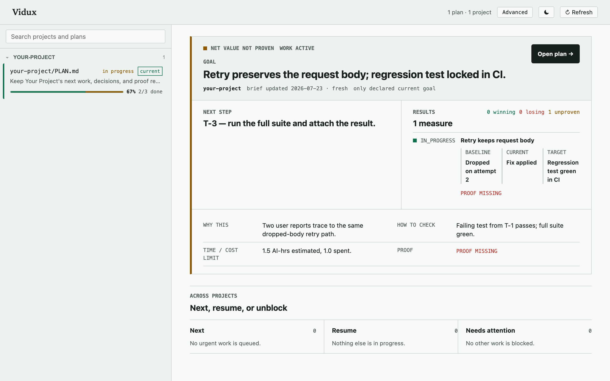

<p align="center">
  
</p>

<p align="center">
  <a href="https://github.com/firstbitelabsllc/vidux/stargazers"></a>
  <a href="LICENSE"></a>
  
</p>

# Vidux

A coding agent loses everything when its session ends. Vidux keeps the
recovery packet in plain repository files — a `PLAN.md` holding priorities and
decisions, evidence stored next to the work, and a checkpoint naming the exact
next action — so the next run resumes where the last one stopped, whether
that's the same agent, a different tool, or you a week later.

Reach for it when the work will outlive one session. Skip it for a quick fix.

## Quick start

Vidux is an agent skill first — you don't type vidux commands.

```bash
git clone https://github.com/firstbitelabsllc/vidux.git ~/Development/vidux
mkdir -p "$HOME/.claude/skills"
ln -sfn "$HOME/Development/vidux" "$HOME/.claude/skills/vidux"
```

Then, in any project, two sentences do everything:

- **`/vidux "what you're working on"`** — the first cycle scaffolds `PLAN.md`,
  gathers evidence, and fills it in. No code until the plan is ready.
- **"open the vidux dashboard"** — starts the local cockpit at
  `http://127.0.0.1:7191`, scoped to your repo.

Requirements: Bash, Git, Python 3.9 or newer. No service, database, account,
or API key. Details: [Installation](docs/guide/installation.md) ·
[Quickstart](docs/guide/quickstart.md).

<p align="center">
  
</p>

The board refuses to trust prose: a measure without an attached artifact shows
`PROOF MISSING` until one exists. It binds to loopback only by default — read
[the browser reference](docs/reference/browser.md) before binding wider.

## How it works

Every run is the same loop — READ → ASSESS → ACT → VERIFY → CHECKPOINT — and
git transports the change; chat history is never the authority. The depth
lives in the docs: [the cycle](docs/concepts/cycle.md) ·
[plan structure](docs/concepts/plan-structure.md) ·
[principles](docs/concepts/principles.md) ·
[CLI](docs/reference/commands.md) · [config](docs/reference/config.md) ·
[hooks](docs/reference/hooks.md).

The skill shells out to a small CLI (`init`, `status`, `browse`, `doctor`) you
can drive directly — put it on your PATH with
`ln -sfn "$HOME/Development/vidux/bin/vidux" "$HOME/.local/bin/vidux"`.

<p align="center">
  
</p>

## Where Vidux stops

Vidux does not schedule agents, route models, execute workers, or hold
provider credentials — your coding host does all of that. Vidux can record
provider-neutral claims for concurrent work, but it never launches a provider
or selects a model. The dashboard is a local view, not a hosted service. No
benchmark harness ships here. The value is durable recovery, not raw speed.

## Release truth and contributing

Vidux installs from source; there is no npm package on the registry, though
[Installation](docs/guide/installation.md) covers an optional locally-built
tarball. The `1.0.0` in `VERSION` marks the source contract and matches the
`v1.0.0` git tag and its GitHub Release.

`npm ci && npm run verify` runs the JS and Python contract tests plus the
public-ready content gate. Start with [ARCHITECTURE.md](ARCHITECTURE.md) and
[CONTRIBUTING.md](CONTRIBUTING.md). MIT licensed.
