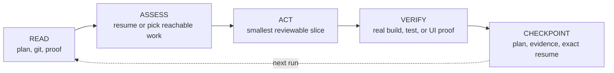

<p align="center">
  
</p>

<p align="center">
  <a href="https://github.com/firstbitelabsllc/vidux/stargazers"></a>
  <a href="LICENSE"></a>
  
</p>

# Vidux

A coding agent loses everything when its session ends: the plan, the reasoning,
the half-finished task. Vidux keeps that recovery packet in plain repository
files, so the next run resumes exactly where the last one stopped, whether the
next run is the same agent, a different tool, or you a week later.

It is three things and nothing more:

- a **`PLAN.md`** that holds priorities and decisions,
- **evidence** stored next to the work, and
- a **checkpoint** that names the exact next action.

Your coding host still picks the models, spawns the workers, and runs the tools.
Vidux never touches any of that.

**Reach for it when the work will outlive one session. Skip it for a quick fix
that a plan would only slow down.**

<p align="center">
  
</p>

## Quick start

You need Bash, Git, and Python 3.9 or newer. No service, database, account, or
API key.

```bash
git clone https://github.com/firstbitelabsllc/vidux.git ~/Development/vidux
mkdir -p "$HOME/.local/bin"
ln -sfn "$HOME/Development/vidux/bin/vidux" "$HOME/.local/bin/vidux"
export PATH="$HOME/.local/bin:$PATH"   # add to your shell profile to keep it

cd /path/to/your-project
vidux init --here          # scaffolds PLAN.md; never overwrites an existing one
vidux browse --root .      # local cockpit at http://127.0.0.1:7191, scoped to this repo
```

`vidux browse` scans `~/Development` by default, so pass `--root .` (or set
`VIDUX_DEV_ROOT`) when your project lives elsewhere — otherwise this project's
plan is absent from the cockpit (you see only plans under the default root).
`vidux status` reads the same scan root.

To run the cycle itself, load the agent skill (see [Agent skill and
plugin](#agent-skill-and-plugin)) and, in Claude Code, run `/vidux "what you're
working on"`. `vidux init --here` already scaffolded the `PLAN.md`; the first
cycle reads it, gathers evidence, and fills it in — no code until the plan is
ready.

## The five-step cycle

Every run is the same small loop:



The plan answers what matters next and why. A checkpoint records what changed,
the weakest claim the evidence supports, and the exact next action. Git
transports the change; chat history is never the authority.

## What the plan looks like

`vidux init --here` scaffolds one file with these sections:

- **Purpose** and **Evidence**: the goal, and the sources that justify it.
- **Constraints** and **Operator Brief**: the rails, and the current state.
- **Outcome Scorecard** and **Tasks**: how you know it is done, and the ordered
  work. Tasks move `pending → in_progress → completed`, with `blocked` terminal
  until replaced.
- **Decision Log** and **Progress**: an append-only record of why and when.

The invariants it enforces: plan prose is not proof, a merge is not a deploy,
skipped gates stay visible, a worker's "done" is not acceptance, and a task
cannot silently vanish during a merge. An unclear root cause gets one linked
`investigations/<slug>.md`, never another queue.

## Local cockpit

```bash
vidux browse
```

A read-mostly browser view of the plans under your scan root: active and blocked
work, rendered evidence, local comments, and plan-scoped steering. Markdown
stays the source of truth; comments and claims are separate, append-only local
state.

The safety boundary is strict: loopback binding by default, Host and Origin
validation on write routes, HTML artifacts rendered in a sandboxed,
network-isolated iframe (no scripts, forms, nested frames, popups, or external
loads), sensitive-value redaction, and symlink rejection on writable files. LAN
viewers cannot write plan state. Set `VIDUX_BROWSER_HOST=0.0.0.0` only on a
trusted LAN, and read [`docs/reference/browser.md`](docs/reference/browser.md)
first.

## Where Vidux stops

This boundary is the point: use the best coding host you can without tying your
project's recovery story to that host's private memory.

- Vidux does not schedule agents, route models, execute workers, or hold
  provider credentials.
- Vidux can record provider-neutral claims for concurrent work, but it never
  launches a provider or selects a model. An external append-only ledger can add
  durable publish receipts; it is a companion, not a second planning authority.
- The cockpit is a local operational view, not a hosted collaboration service.
- No benchmark harness, provider runner, or scoring implementation ships here;
  evaluation belongs to the host.
- Vidux optimizes for durable recovery, not raw speed. The value is that a plan,
  its evidence, and the resume point survive a lost session.
- macOS is the primary environment. Core scripts are portable, but OS scheduling
  examples need platform-specific adaptation.

## CLI

```text
vidux init --here    create a PLAN.md without overwriting one
vidux status         summarize plans under the scan root
vidux browse         start the local cockpit
vidux doctor         verify the local installation
```

Run `vidux help <command>` for options, and `vidux doctor --json` for
machine-readable install truth. One doctor check runs the contract self-test
(`npm test`), which needs the dev dependencies (`npm ci`). On a fresh clone that
has not run `npm ci`, that check reports `[WARN]` and skips the suite — the
doctor still exits `0`, because the runtime is Bash, Git, and Python only.

## Configuration

The live config is `$XDG_CONFIG_HOME/vidux/vidux.config.json` (or
`~/.config/vidux/vidux.config.json`). The checked-in
[`vidux.config.example.json`](vidux.config.example.json) documents the shape.

```bash
python3 scripts/vidux-config.py init
python3 scripts/vidux-config.py check --json
```

`plan_store` is `inline` for a repo-local plan, `local` for a configured
persistent path, or `external` for a path outside the repository. Vidux never
writes a central plan inside its own installation.

## Agent skill and plugin

The repository ships exactly one agent skill at root [`SKILL.md`](SKILL.md).
Claude Code can load it as a local skill or through the plugin manifest:

```bash
mkdir -p "$HOME/.claude/skills"
ln -sfn "$HOME/Development/vidux" "$HOME/.claude/skills/vidux"
# alternative, not in addition:
claude --plugin-dir "$HOME/Development/vidux"
```

Other coding hosts read `SKILL.md` directly. Optional Git hooks live in
`hooks/`; copy only the ones you intend to enforce. Vidux installs no hooks or
background jobs implicitly.

## Install and release truth

Vidux installs from source (see Quick start); there is no npm package on the
registry, though [Installation](docs/guide/installation.md) covers an optional
locally-built `npm pack` tarball for a global CLI. The `1.0.0` in `VERSION`
marks the source contract and matches the `v1.0.0` git tag and its GitHub
Release. Node 20 or newer is needed only for that tarball, contributor tests,
and docs.

## Contributing

```bash
npm ci
npm run verify        # JS + Python contract tests + the public-ready content gate
npm run docs:build
npm run test:e2e      # for browser changes
```

Start with [Architecture](ARCHITECTURE.md), [the doctrine](DOCTRINE.md), [the
evidence format](guides/evidence-format.md), and the
[bug-fix example](examples/bug-fix-lifecycle/). See
[CONTRIBUTING.md](CONTRIBUTING.md), [SECURITY.md](SECURITY.md), and
[SUPPORT.md](SUPPORT.md) before opening a change.

Vidux is MIT licensed.
