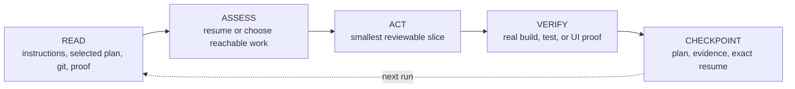

<p align="center">
  
</p>

<p align="center">
  <a href="https://github.com/firstbitelabsllc/vidux/stargazers"></a>
  <a href="LICENSE"></a>
  
</p>

# Vidux

Vidux is a thin plan, proof, and resume layer for coding work that must survive
sessions, agents, tools, and interruptions.

It keeps the recovery packet in ordinary repository files: one selected plan
for priorities and decisions, evidence beside the work, and exact checkpoints
for the next run. Your coding host still chooses models, creates workers, and
executes tools.

**Use Vidux when the work will outlive one focused session. Skip it when a tiny,
obvious repair would only gain ceremony.**

<p align="center">
  
</p>

## Quick start

Vidux's core runtime needs Bash, Git, and Python 3.9 or newer. No service,
database, account, or API key is required.

```bash
git clone https://github.com/firstbitelabsllc/vidux.git ~/Development/vidux
mkdir -p "$HOME/.local/bin"
ln -sfn "$HOME/Development/vidux/bin/vidux" "$HOME/.local/bin/vidux"
export PATH="$HOME/.local/bin:$PATH"

cd /path/to/your-project
vidux init --here
vidux browse
```

`vidux init --here` creates a repo-local `PLAN.md` only when one does not
already exist. `vidux browse` opens the local cockpit at
<http://127.0.0.1:7191>. The default scan root is `~/Development`; set
`VIDUX_DEV_ROOT=/path/to/projects` when your repositories live elsewhere.

To keep `~/.local/bin` on `PATH`, add this line to your shell profile:

```bash
export PATH="$HOME/.local/bin:$PATH"
```

## The five-step cycle

Every run follows the same small loop:



The selected plan answers what matters next and why. A checkpoint records what
changed, the weakest claim the evidence supports, and the exact next action.
Every cycle rehydrates from that plan, current Git state, and the smallest
relevant proof. Git transports the change; chat history is never the authority.

## Coordination Boundary

Vidux is intentionally one layer in a larger toolchain:

| Layer | Owns | Does not own |
| --- | --- | --- |
| **Vidux** | Repo-local plan, decisions, evidence links, checkpoint, resume, optional cockpit | Model choice, provider transport, worker execution, private host policy |
| **Coding host or supervisor** | Runners, models, delegation, tool execution, worker foldback | A replacement project queue hidden outside the repo |
| **Append-only ledger adapter** | Activity/publish receipts, file claims, worktree-lifecycle evidence | Plan priority, routing, final acceptance |

Vidux can record provider-neutral claims for concurrent work, but it never
launches a provider or selects a model. An external append-only ledger can add
durable publish receipts; it is a companion, not a second planning authority
and not code shipped by this package.

The host still owns scheduling, runners, roles, dispatch, and final acceptance.

This separation is the point: use the best available coding host without
making the project's recovery story depend on that host's private memory.

## The plan contract

One selected planning authority governs the project. Use the root `PLAN.md` or a supported repo-native named plan.
Vidux never creates a shadow plan beside an active authority.

`vidux init --here` scaffolds these sections:

- Purpose and evidence;
- constraints and an operator brief;
- an outcome scorecard and ordered tasks;
- a decision log; and
- an append-only progress record.

Resume `[in_progress]` work first. When evidence changes the direction, update
the same plan's decision or progress record before changing code. Unclear root
cause may use one linked `investigations/<slug>.md`; it is not another queue.

The hard invariants are:

- plan prose is not proof;
- a merge is not deployment or runtime proof;
- unknown or skipped gates stay visible;
- a worker's completion is not lead acceptance;
- unknown worktree changes are preserved, never overwritten; and
- a task cannot silently disappear during a merge.

Proof travels with the handoff: the selected plan + publish ledger rows, when a
ledger adapter is configured, preserve what shipped and where to resume.

## Local cockpit

```bash
vidux browse
```

The cockpit scans plans, shows active/blocked work, renders evidence artifacts,
and supports local comments, plan-scoped steering, and provider-neutral work
claims. Markdown remains the source of truth; comments and claims are separate
append-only local state.

HTML artifacts are network-isolated and rendered inside a sandboxed iframe.
Sensitive values are redacted, and affected plans stay visibly marked so a
reviewer knows content was withheld. The safety boundary is strict:

- loopback binding by default;
- Host and Origin validation on write routes;
- sandboxed, network-isolated HTML artifacts;
- no artifact scripts, forms, nested frames, popups, or external loads;
- sensitive-value redaction for allowed text/metadata;
- symlink and hard-link rejection on writable files; and
- LAN viewers cannot write plan state.

Set `VIDUX_BROWSER_HOST=0.0.0.0` only on a trusted LAN. Read
[`docs/reference/browser.md`](docs/reference/browser.md) before exposing the
cockpit or writing artifacts.

## CLI map

```text
vidux init --here       create a PLAN.md without overwriting one
vidux status            summarize plans under the scan root
vidux browse            start the local cockpit
vidux doctor            verify the local installation
```

Run `vidux help <command>` for exact options. The cockpit's steering and
claims panels store intent and short-lived work leases as append-only local
state.

`vidux doctor` reports install truth and readiness. One of its checks runs the
contract self-test (`npm test`), which needs the dev dependencies (`npm ci`) —
that is a maintainer check, not a requirement to use vidux. The core runtime is
Bash, Git, and Python only (see Quick start): a fresh clone runs `init`,
`status`, and `browse` with no `npm ci`. So a red contract-suite line on a
source checkout that has not run `npm ci` means the dev test environment is
unset, not that the install is broken.

## Configuration

The live config is `$XDG_CONFIG_HOME/vidux/vidux.config.json` or
`~/.config/vidux/vidux.config.json`. The checked-in
[`vidux.config.example.json`](vidux.config.example.json) documents the shape; it
is not active configuration.

```bash
python3 scripts/vidux-config.py init
python3 scripts/vidux-config.py check --json
vidux status --root /path/to/projects
```

The `plan_store` mode is `inline` for a repo-local plan, `local` for a configured
persistent path, or `external` for a path outside the repository. Central plans
must use an explicit persistent store; Vidux never writes them inside its own
installation.

## Agent skill and plugin

The repository ships exactly one agent skill at root `SKILL.md`. Claude Code
can load that same entry point either as a local skill or through the included
plugin manifest:

```bash
ln -sfn /path/to/vidux "$HOME/.claude/skills/vidux"
# alternative, not in addition:
claude --plugin-dir /path/to/vidux
```

Other coding hosts can read `SKILL.md` directly. Optional Git hooks live in
`hooks/`; copy only the hooks you intend to enforce. Vidux does not install
hooks or background jobs implicitly.

## Installation and release truth

Vidux is installed from source (see Quick start); there is no npm package. The
`1.0.0` in `VERSION` marks the source contract and matches the `v1.0.0` git tag
and its GitHub Release.

Node 20 or newer is needed only for contributor tests and docs; the installed
runtime is Bash plus the Python standard library.

## Where Vidux stops

- Vidux does not schedule agents, route models, execute workers, or proxy
  provider credentials.
- The cockpit is a local operational view, not a hosted collaboration service.
- No benchmark harness, provider runner, evaluator, or scoring
  implementation ships here; evaluation belongs to the host.
- Vidux optimizes for durable recovery, not raw speed. Its value is that a
  plan, its evidence, and the exact resume point survive a lost session — not a
  throughput claim.
- macOS is the primary development environment. Core runtime scripts are
  portable; OS scheduling examples require platform-specific adaptation.

## Contributing

```bash
npm ci
npm run verify
npm run docs:build
# Browser changes:
npm run test:e2e
```

`npm run verify` runs JavaScript and Python contract tests plus the public-ready
content gate. Build/test/lint workflows are manual-only; secret scanning covers
pull-request heads and pushes to `main`.

Start with [Architecture](ARCHITECTURE.md), [the evidence format](guides/evidence-format.md),
[investigation lifecycle](guides/investigation.md), and the
[bug-fix example](examples/bug-fix-lifecycle/). See [CONTRIBUTING.md](CONTRIBUTING.md),
[SECURITY.md](SECURITY.md), and [SUPPORT.md](SUPPORT.md) before opening a change.

Vidux is MIT licensed.
